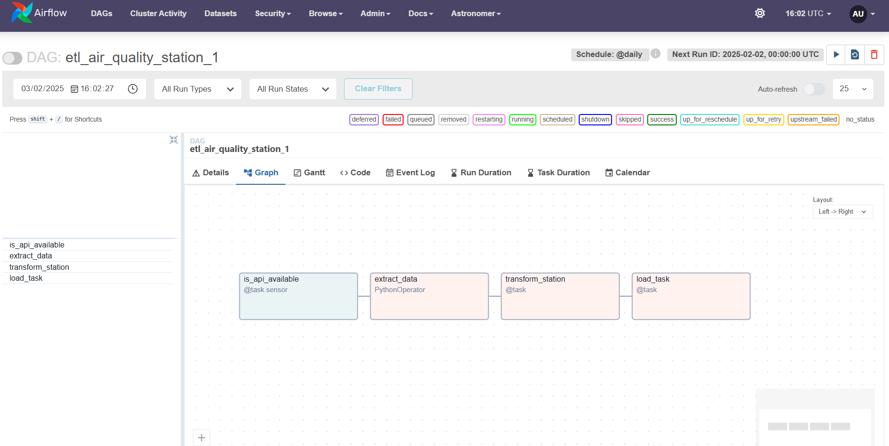

# Hiring Challenge: Data Engineer (ETL Air Quality Project)

Data354 accompagne les organisations publiques et privées dans la valorisation de leurs données. Ce challenge vise à démontrer mes compétences en :

- Analyse métier et compréhension des besoins
- Extraction et transformation des données
- Programmation en Python et orchestration d’ETL
- Stockage des données (MongoDB)
- Visualisation des données (Apache Superset)
(Optionnel) Prévision avec un modèle de Machine Learning

## Solution 
La solution se décompose en plusieurs modules :

- Extraction : Récupération des données horaires depuis l’API AirQino deux  capteurs.
- Transformation : Calcul des moyennes journalières de CO et PM2.5.
- Chargement : Stockage des résultats dans des bases de données MongoDB distinctes pour chaque capteur.
- Visualisation : Création d’un dashboard interactif dans Apache Superset pour visualiser les tendances.
(Optionnel) Forecasting : Modèle de Machine Learning pour prédire les valeurs sur les prochaines heures.


## Architectures du projet

Création d'une pipeline orchestré avec Airflow , et la gestion des dépendances entre les différentes tâches est assurée par des opérateurs Python. Les fonctions d'extraction, de transformation et de chargement sont regroupées dans un module utilitaire.

Le projet s'appuie sur les technologies et services suivants :

- **Python** : pour le développement des fonctions ETL.
- **Pandas** : pour la manipulation et la transformation des données.
- **Requests** : pour interagir avec l'API.
- **MongoDB (local)** : pour stocker les données transformées.
- **MongoDB Compass** :  Pour avoir accès aux données sur une interface graphique
- **Airflow (Astronomer)** : pour orchestrer le pipeline ETL.
- **Docker & Docker Compose** : pour le déploiement et l'orchestration des différents services.
- **Apache Superset** : Pour la visualisation des données 


Le pipeline est organisé en quatre étapes principales :


1. **Verifier la diponibilité de l'API**
2. **Extraction** : Appel à l'API pour récupérer les données horaires de la station.
3. **Transformation** : Conversion des données brutes en moyennes journalières.
4. **Chargement** : Insertion des données transformées dans MongoDB Compass.


## Prérequis

- [Docker](https://www.docker.com/get-started)
- [Docker Compose](https://docs.docker.com/compose/)
- Compte GitHub pour cloner le projet
- [Astro CLI ](https://www.astronomer.io/docs/astro/cli/install-cli)
- [MongoDB Compass](https://www.mongodb.com/try/download/compass)
- [MongoDB](https://www.mongodb.com/try/download/shell)
- Python 3.8+
- [Apache drill](https://drill.apache.org/download/)


## Installation

1. **Cloner le dépôt GitHub** :

   ```bash
   git clone https://github.com/YORAM12LUX/Hirring_Challenge.git
   cd Hirring_Challenge
2. **Configuration de Docker-Compose**:
Ici nous avons deux dossiers images pour créer les conteneurs de Superset et Airflow respectivement 


## Configuration

1. Airflow :

Configurez une connexion Airflow nommée air_quality_api via l'interface Web d'Airflow (Admin > Connections).
Exemple de configuration pour air_quality_api :
- Conn ID : air_quality_api
- Conn Type : HTTP
- Host : https://airqino-api.magentalab.it
- Extra (format JSON) : 
{
  "endpoint": "/v3/getStationHourlyAvg",
  "headers": {
    "Content-Type": "application/json"
  }
}


## Exécution et installation locale

1. Installation et Configuration de MongoDB :


 - Téléchargez et installez MongoDB Shell depuis le site officiel de MongoDB.
 - Téléchargez et installez MongoDB Compass.
 - Démarrer le Service MongoDB :

Assurez-vous que le service MongoDB est démarré sur votre machine (par exemple, via mongod,mongo ou en utilisant MongoDB Desktop).
Connecter MongoDB Compass :

Ouvrez MongoDB Compass et connectez-vous en utilisant l'URL de connexion (par exemple, mongodb://localhost:27017).

2. Installation et Configuration d'Apache Drill

- Rendez-vous sur le site d'Apache Drill et téléchargez le fichier ZIP de l'outil.
- Décompressez l'archive dans un dossier de votre choix.
- Lancer Apache Drill en Mode Embedded :

    Ouvrez une invite de commandes (CMD) et naviguez dans le dossier bin du dossier décompressé.
  Exécutez la commande suivante pour lancer le service :

```bash
drill-embedded

```
Apache Drill démarre et l'interface graphique est accessible via son URL (souvent http://localhost:8047).
Configurer le Stockage dans Drill :
- Allez dans la section Storage.
- Recherchez la configuration pour MongoDB et activez l'option (Enable).
- Configurez la base en renseignant l’URL de connexion vers votre MongoDB (par exemple, mongodb://localhost:27017).

3. Installation et Configuration d'Astronomer (Airflow)

- Rendez-vous sur le site d'Astronomer et téléchargez le fichier .exe.
- Placez l’exécutable dans un dossier dédié.
- Ajoutez le chemin vers ce dossier dans votre variable d'environnement (PATH) afin de pouvoir utiliser la commande astro.
Initialisation de l'Image et Lancement d'Airflow :

Créez un dossier vide pour initialiser votre projet Astronomer.
Ouvrez une invite de commandes, placez-vous dans ce dossier et exécutez :


```bash
astro dev init
astro dev start
```
- Vous pourrez accéder à l'interface Airflow pour visualiser et exécuter vos DAGs.

4. Installation et Configuration d'Apache Superset

- Utiliser Docker Compose pour créer l'image Superset
- Dans un terminal, placez-vous dans le dossier contenant le fichier docker-compose-image-tag.yml et exécutez :
```bash
docker compose -f docker-compose-image-tag.yml build
docker compose -f docker-compose-image-tag.yml up -d
```
- Accéder à l'Interface Superset :
```bash
http://localhost:8088/login
Username : admin
Password : admin
```
Installation du JDBC de Drill dans Superset :
pip install sqlalchemy 
Pour connecter Superset à MongoDB via Apache Drill, installez le JDBC de Drill dans l'image Superset.
```bash
pip install sqlalchemy 
```
Configurez la source de données dans Superset avec une chaîne SQLAlchemy de type MySQL, par exemple :
```bash
drill+sadrill://host.docker.internal:8047/dfs
```
Vous pourrez ainsi accéder aux bases MongoDB exposées via Drill et créer vos visualisations.

5. Exécution du Projet
Démarrer MongoDB : Assurez-vous que MongoDB est démarré et accessible via Compass.

Lancer Apache Drill :

Dans l'invite de commandes, lancez drill-embedded pour démarrer le service.
Configurez le stockage pour activer MongoDB et renseignez l'URL correcte.

Démarrer Airflow via Astronomer :
Dans le dossier de votre projet Astronomer, exécutez astro dev init puis astro dev start.
Vérifiez les DAGs créés dans l'interface Airflow et lancez-les pour traiter les données.

Lancer Apache Superset via Docker :
Assurez-vous que le conteneur Superset est lancé.
Configurez la source de données dans Superset pour pointer vers Drill (qui expose MongoDB) et visualisez les dashboards.
Vérifier les Données :

Une fois les DAGs exécutés par Airflow, les données sont stockées dans MongoDB.
Utilisez MongoDB Compass pour vérifier le stockage des données.
Dans Superset, vous pourrez créer des visualisations basées sur ces données.


## Vue de la pipeline


### UI Airflow 


### Worflow Station 1




### Worflow Station 2


## Dashborad Superset 


## Dashboard BI


## Alternative : Une solution dockerisé

Avantages

- Portabilité : L'ensemble du stack (MongoDB, Apache Drill, Astronomer/Airflow, Apache Superset) est encapsulé dans des conteneurs Docker, ce qui facilite le déploiement sur n'importe quelle machine disposant de Docker.

- Reproductibilité : La configuration est centralisée dans un fichier docker-compose.yml. Vous pouvez ainsi déployer le même environnement de développement ou de production sans variation.

- Isolation : Chaque service s'exécute dans son conteneur, limitant ainsi les conflits de dépendances et facilitant la gestion des mises à jour.

- Simplicité : Une fois le fichier Docker Compose rédigé, il suffit d'une seule commande pour lancer l'ensemble des services.


## FAQ

#### Question 1

Je dockeriserais l’ensemble du pipeline ETL. Cela garantit que toutes les dépendances (bibliothèques Python, scripts, outils) sont encapsulées dans une image Docker. Le déploiement se fait ainsi de manière identique sur tous les environnements (développement, test, production).

Mon plan consiste à dockeriser le pipeline ETL et à le déployer en utilisant une solution d'orchestration comme Docker Compose. De plus, je mettrai en place une pipeline CI/CD, des tests automatisés, ainsi que des outils de surveillance et de sécurité.

#### Question 2

J’opterais pour Apache Airflow afin d’automatiser l’exécution horaire de l’ETL. Airflow offre une gestion avancée des tâches, une reprise automatique en cas d’erreur et une interface web pour le suivi en temps réel.

L’orchestration se fera à l’aide de DAGs (Directed Acyclic Graphs), où chaque tâche (extraction, transformation, chargement) sera exécutée à un intervalle défini (ici, toutes les heures). Airflow permet également de gérer les dépendances entre tâches et de redémarrer automatiquement celles qui échouent.

Alternativement, une planification via un cron job intégré dans un conteneur ou l’utilisation des services cloud pourrait être envisagée en fonction des contraintes d’infrastructure et des besoins en scalabilité. 

Par exemple, en créant un conteneur dédié qui exécute la commande python etl_pipeline.py chaque heure (en configurant le cron à l’intérieur du conteneur).
Cette solution est simple à mettre en place, bien que moins riche en fonctionnalités (gestion des dépendances, redémarrage en cas d’échec) qu’Airflow.


## Conclusion

Ce projet montre la mise en place d’un pipeline ETL robuste, de l’extraction à la transformation puis au chargement des données de qualité de l’air, le tout orchestré par Apache Airflow. Nous avons relevé plusieurs défis techniques, notamment la gestion de la sérialisation des DataFrames via XCom et la coordination fine des tâches dans un environnement conteneurisé. Grâce à Airflow, nous bénéficions d’une planification fiable, d’une reprise automatique en cas d’échec et d’une interface de suivi intuitive, garantissant ainsi une automatisation  efficace et maintenable. Ce projet ouvre la voie à des développements futurs pour améliorer la scalabilité et l’intégration d’autres sources de données.